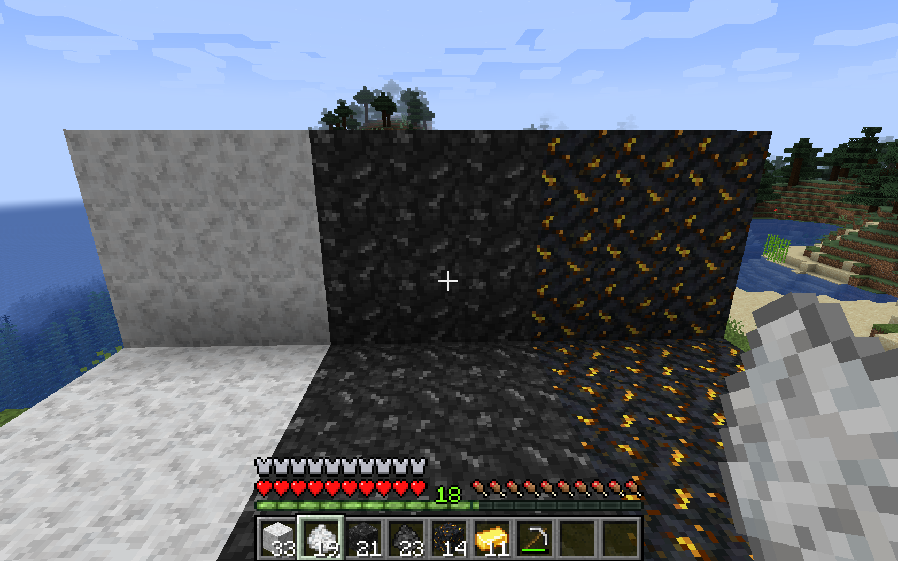
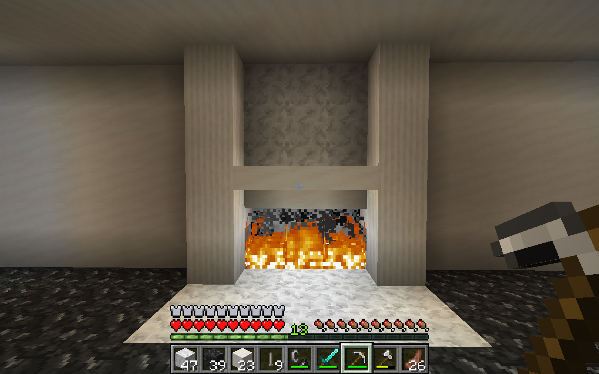
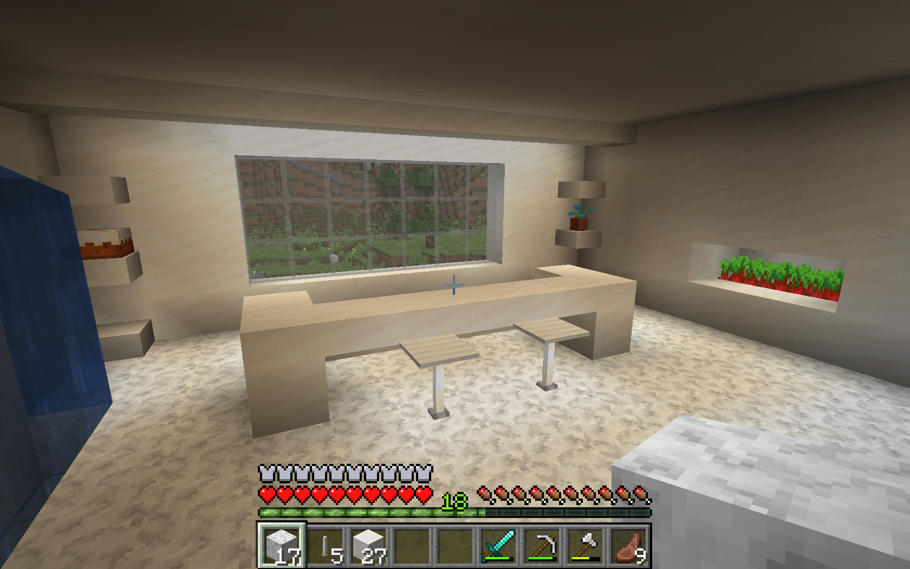
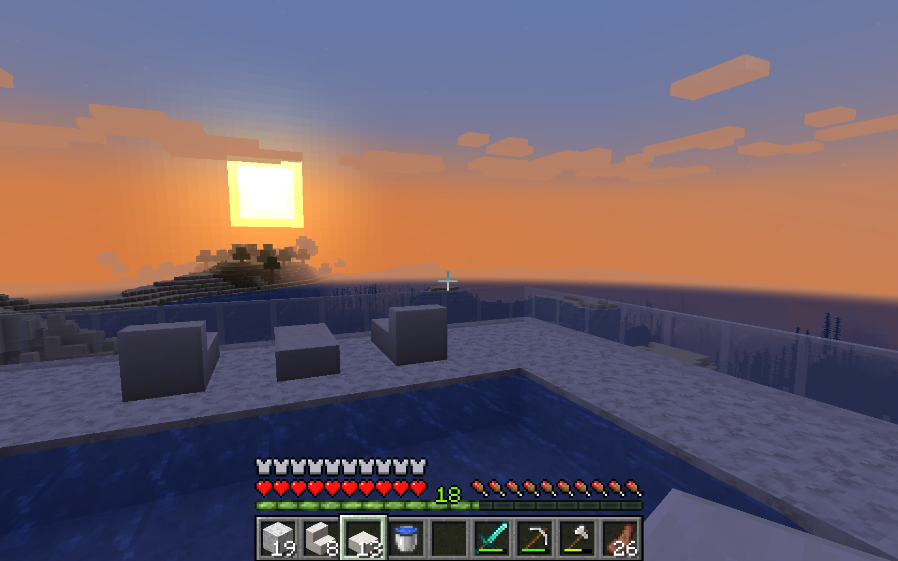

# Minecraft Marble Mod

A Minecraft mod that adds decorative marble blocks into your world. This was created using FabricMC's mod example template and coded in Java. It allows the player to craft light, dark, and gold marble blocks using different limestones depending on each block's crafting recipe.

Here is a demo of each marble block. Starting from the left: light marble, dark marble, gold marble

&nbsp;   &nbsp;   &nbsp;   &nbsp;   &nbsp;  
A demo of different marble blocks used to decorate a user's Minecraft world.

